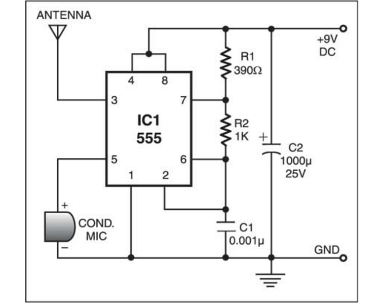
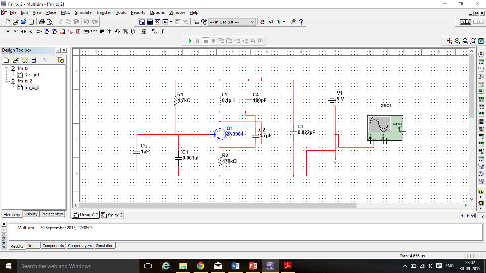
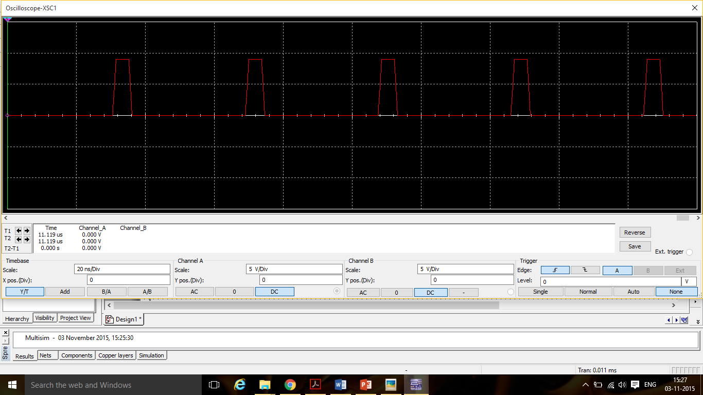
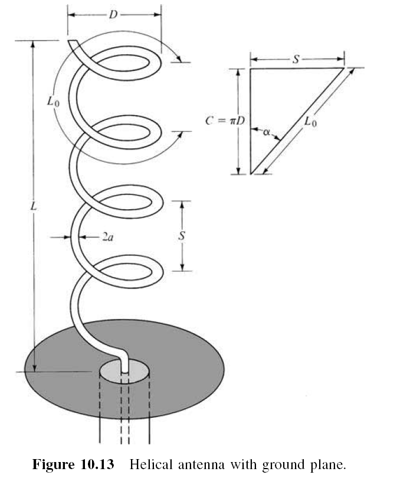

Frequency modulation (FM) is a type of the angle modulation. This modulation technique is used for commercial radio broadcasting. Due to the rapid development of IC, most of the FM transmitters are constructed and designed using modulator IC chips. 
This project aims to construct a simple radio transmitter for transmission up to few metres. It is basically an FM modulator whose signal can be received on a normal FM radio.
-	A condenser microphone is used for speaking. 
- The output of the condenser microphone is used to modulate the carrier frequency. 
- This frequency produces an electromagnetic wave, which can be detected by a nearby radio receiver, and one can hear one’s own voice in that radio.

### Circuit Diagram:

  

 

### Circuit Components:

- Resistors       1000Ω, 1kΩ
- Capacitors      1000µF, 6.8pF
- IC              LM555
- Condenser microphone
- 9V battery
- Copper wires, 
- Breadboard, etc.

Design:

IC 555 is used in astable multi-vibrator mode.
Since for a FM transmitter the carrier frequency range should be between 87.5 to 108 MHz.

From datasheet of IC 555 Timer, 

The frequency of oscillation is,
  **f = 1/T = 1.44/ ((Ra + Rb)*C)**

The Duty Cycle is,
  **D = Ra/ (Ra + 2*Rb)**

We have designed our circuit such that the Duty cycle comes out to be 50% (because that results in maximum deviation in both cycles i.e Ton and Toff).
Using above two formula, we get Frequency of oscillation as 100.8 MHz.

### Design to Improve Range to around 10m:

  

 

### Components Required

-	Power supply 9V
- Resistors  4.7k Ω, 470Ω
-	Capacitors 0.001µF, 4.7µF, 0.022µF
-	Trimmer capacitor 10-100pF
-	Inductor 0.1µH (26 turns, 0.25 inch diameter, 10 inch length using 18 guage copper wire)
-	Transistor 2N3904
-	Condenser Mic
-	Antenna (Copper wire of 20 cm long and 24 gauge)

Frequency of Oscillation = 1/((2π)sqrt(LC))
					                = 91.88 MHz

### How is it Better?

The above circuit arrangement enables us to obtain stable oscillations because it makes use of the LC tank network which is an improvisation upon IC 555 timer which generates only simple square wave signals.

  

 

### Hardware Implementation:

We are giving an audio signal (20 to 20KHz) and observing it at the frequency of oscillation as calculated above.
We used song from a mp3 player as an input audio signal (at the mic) and using a FM radio app in Mobile we tried to observe the output at various frequencies by tuning the frequency in the radio app. The idea is to get the sound (played at the input) at the receiver(which is the radio here) ,at a frequency near to the theoretical value.

### Helical Antenna :
A conducting wire that is wound in the form of a screw thread along with a ground plane (a metallic conductor of specific shape and dimensions) is referred as helical antenna.
Geometrically a helix can be characterized as a wire having N turns of diameter D and a spacing or pitch of S between each turn. The total length of the antenna is then L = NS.
While total length of the wire used to wind the coil is given as Ln = NL0 = NÖ(S2+C2). Where C = pD is the circumference.

  

 

Here in our design we have used an antenna having 
-	N =8 turns; 					
-	Spacing S=0.4cm;
-	L =NS =3.2cm; 
-	C =pD =p(1.0cm)=3.14cm;  
-	Ln = NL0 = NÖ(0.42+3.142)=25.33cm;
-	Input Impedence =   =140(0.0314/3.3334) =1.319   ;

### APPLICATION

This project is implemented on a miniature scale and hence has a low transmission range. However, if the high power circuits and efficient antennas are used, there are several possible applications for the basic principle used in this project-
- It can be used as an instant public addressing system as the message transmitted can received by commonly available FM radios.
- By adjusting the carrier frequency, a secure one-to-one communication may be implemented.
- The circuit can also be used as an FM receiver tester.
