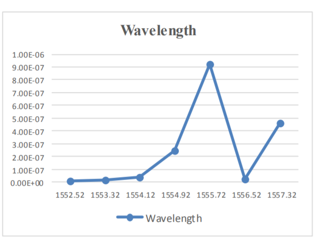

  
The core component of a global communication network has been the use of optical fiber networks, which is a telecommunications network with optical fiber as the primary transmission medium, designed in such a way that it makes full use of the unique attributes of optical fibers. To overcome the challenge to deal with the rapid growth of the Internet, Optical Submarine Networks provide a fasr reliable communication. 
 
***In this project we are going to stimulate and maximize the distance for a section of submarine optical network between two repeaters or between two amplifiers for which the least error or BER is observed.***
  
### Introduction:
An optical fiber communication system consists of a transmitter which converts the electrical signals to optical and place it on the optical fiber cable for transmission, a bundle of optical fiber cables packed into one large cable is used as the medium for light to travel, several amplifiers and to convert back the optical signal to electrical
signal, an optical receiver is also used.
 
For fast mode of communication over long distances, we use submarine networks via the sea routes, where the cables generally carry the data which is digitally modulated. As the distance between the two components is significantly large, even though we are using optical fiber communication, repeaters and amplifiers has to be used. The repeater contains several equipment for the applications such as error measurement and its control and signal reforming. 
 
In the case of repeaters, a solid state laser is used to again place the signal into the fiber. This laser acts as an amplifier because when it starts the emission, a short length of the doped fiber also gets excited. Now this excited part of the fiber also acts as a laser and in result, amplifies the signal.
 
We can use the concept of DWDM with optical communication to make it even better and efficient. A constant current is passed through the center of the cable which powers up the repeaters. Hence we can say that all the repeaters attach to any system are in series with each other.
 
A positive voltage is applied from one end of the cable and a negative voltage from the other. A virtual ground point exists roughly halfway through the cable. We use optical fiber for long distance communications from under the sea because of its extraordinary efficiency and the permissibility to transmit for over 100s of kilometers without any repeater or amplifier in between. Some distortion gets added on inserting any amplifier of repeater in between the optical fiber link. Hence we have to minimize the use of amplifiers or repeaters for this kind of transmissions.

  
### Optical Submarine Networks:
Optical submarine networks are actually a part of a larger optical communication network that is deployed into the ocean, and are usually capable of supporting large data rates and multiple services.
 
The ranges of the transmission distances for these systems are,
- Long-haul optical fiber networks from 600 to 1000 km;
- Extended-long-haul (ELH) from 1000 to 2000 km;
- Ultra-long-haul (ULH) above 2000 km.
 
The above is usually accomplished by employing Dense Wavelength Division Multiplexing (DWDM). The distance between in line amplifiers or repeaters should be large.
 

### System parameters:
-  **TOTAL CAPACITY**: 80Gbps
-  **BIT RATE PER CHANNEL**: 10Gbps
-  **MODULATION SCHEME**: NRZ
-  **SIGNAL WAVELENGTH**: 1552.42 to 1558.12nm
-  **CHANNEL SPACING**: 100Ghz or 0.8nm
-  **MAXIMUM SYSTEM LENGTH**: 840Km
-  **REPEATER SPAN**: 56Km
-  **BIT RATE ERROR**: Less than 10^(-9)[Without error control coding]
-  **OPTICAL FIBER**: Corning submarine SMFL
-  **INPUT POWER**: 1dBm

Wilkinson power dividers are indispensable components of microwave amplifier and antenna distribution circuits, however conventional power dividers are quite large, especially below X-Band where the quarter-wave transmission lines can be several millimeters long.
           
In this project ***the quarter-wave transmission lines of a Wilkinson power divider are reduced using capacitive loading and the transmission line characteristic impedance is correspondingly increased***. To fully illustrate this approach, the characteristics of Wilkinson power dividers with transmission line lengths from λ/5 to λ/12 are presented and compared to the conventional Wilkinson power divider and a lumped element Wilkinson power divider.

### Submarine Line Terminal Equipment:
Fig1: Transmitter Section
 
- Here, 8 channels are used for communication purposes. These 8 channels are passed to an 8×1 multiplexer which mixes the 8 signals into one using Dense WDM concept. 
  
Fig2: Receiver Section
 
- Here, the incoming signal from the optical fiber link is passed through an 8×1 de-multiplexer which separates the dense wavelength division multiplexed 8 signals and give 8 signals as the output.

  

  
  

  

### Simulations:
**Fig1: Transmitter side**
 
On the transmitter side, the components used are:
- A pseudo random bit sequence generator having a generation rate of 10Gbps
- A pulse generator generating pulses with NRZ encoding technique.
- A CW Laser acting as a source of light generating the light of frequency 193 THz.
- A Mach Zehnder modulator is attached at the end
 
**Fig2: Receiver side**
 
On the receiver side, the components used are:
- A Gaussian optical filter to separate the incoming channels based on their respective wavelengths. For each wave, individual Gaussian optical filters are used. The center frequency is tuned to the frequency of corresponding channel. The bandwidth factor in the filter is set equal to the channel spacing.
- An avalanche photodetector is used to detect the incoming optical signal.
- A low pass Bessel filter with the cut-off frequency of 7.5Gbps is used to eliminate high frequency noise.
 
**Fig3: Network Interconnection between Transmitter and Receiver**
 
In between transmitter and reciever, the components used are: 
- Corning submarine (SMFL) is used as the link from transmitter to the standard single mode fiber (SSMF) with, 
  - Dispersion factor as -2ps/nm/km
  - Attenuation factor as 0.2 dB/km
- Standard single mode fiber (SSMF) is used as a link from Corning submarine (SMFL) to the reciever with,
  - Dispersion factor as 16.75ps/nm/km
  - Attenuation factor as 0.2 dB/km
- An erbium doped fiber amplifier (EDFA) is also used with the gain of 10 dB.
 

  
  
  

### Calculation for Maximum System Length:
- Number of loops = 15
- Length of the fiber in each loop is 56 km
- Hence total length = (Length of fiber in each loop) × (Number of loops) = **840 km**

### Results and Inference
For the optical fiber submarine network designed for long haul applications implemented using software simulations in Optisystem, various system parameters were determined and calculated with the aim of optimizing performance such that the transmission range is as long as possible. 
 
The final design achieves reliable communication over a distance of 840 km with a maximum BER 10^(-7) for all the channels.
 
Figure below shows the BER values obtained for different frequencies at receiver side after the communication.
 

  

 
