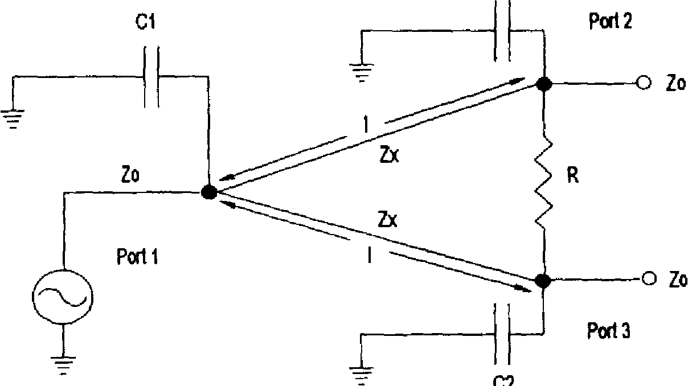

 
This project reports the miniaturization of a planar Wilkinson power divider by capacitive loading of the quarter wave transmission lines employed in conventional Wilkinson power dividers. Reduction of the transmission line segments from λ/4 to between λ/5 and λ/12 are reported here. The input and output lines at the three ports and the lines comprising the divider itself are coplanar waveguide (CPW) and asymmetric coplanar stripline (ACPS), respectively. The 10 GHz power dividers are fabricated on high resistivity silicon (HRS) and alumina wafers.
 
***These miniaturized dividers are 74% smaller than conventional Wilkinson power dividers, and have a return loss better than +30 dB and an insertion loss less than 0.55 dB Design equations.***
 
The paper that was studied and implemented for this project can be found at https://ieeexplore.ieee.org/document/975717

### Introduction :

Wilkinson power dividers are indispensable components of microwave amplifier and antenna distribution circuits, however conventional power dividers are quite large, especially below X-Band where the quarter-wave transmission lines can be several millimeters long.
           
In this project ***the quarter-wave transmission lines of a Wilkinson power divider are reduced using capacitive loading and the transmission line characteristic impedance is correspondingly increased***. To fully illustrate this approach, the characteristics of Wilkinson power dividers with transmission line lengths from λ/5 to λ/12 are presented and compared to the conventional Wilkinson power divider and a lumped element Wilkinson power divider.

### Circuit Diagram :
 

  

 

### 

1)	λ/4 Circuit

    C  = 0 pF    (No Capacitance)
    Z0 = 70.7 ohms
   								
2)	λ/5 Circuit

   C  = 0.07 pF  (C1=0.07 pF and C2=0.14 pF)
   Z0 = 74.4 ohms

 

  
  

 

### Observation

- The dividers exhibit an insertion loss not greater than 0.55 dB for line lengths from λ/5 to λ/12.
 
- Typically, the measured reflection coefficient was less than  -30 dB . The measured bandwidth, defined as the frequency band where |S11| < -15 dB as a function of the transmission line length.
 
- The measured isolation, -20log(S23), is better than 15 dB at the design frequency. However, the frequency of highest isolation increases as the circuit 
size is reduced; maximum isolation occurs approximately 1.5 GHz higher than fo for a λ/12 divider. 
 
### Results and Inference

- Results show that this approach can reduce circuit size by 74 % without significantly increasing the insertion loss or decreasing the bandwidth. This is a significant reduction in area that otherwise would be consumed by conventional Wilkinson power dividers.
 
- At higher frequencies, they perform like a low pass filter with the high frequency rejection increasing as the capacitive loading and the line impedance increases.

  
Please find the project paper used for implementation, report, and AWR simulation at the following drive link, https://drive.google.com/drive/folders/1h4IN08AhqmNwc7bu3oXl0jb5Vu418xLN?usp=sharing
