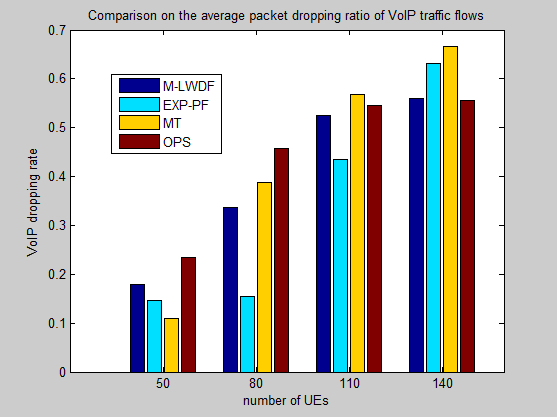

 
Here in this project, I will share my thesis project titled ***QoS provisioning Downlink Resource Management in 4G Cellular System***. I will share the objective, motivation, findings, and learnings. 
 
This thesis is based on a paper implementation of https://ieeexplore.ieee.org/document/7289059.
 
**To find the thesis, please refer to this google drive link, https://drive.google.com/drive/folders/1lCz_kDJBJvwXam7UtPtK3eN1BWmBu2VC?usp=sharing**

### Summary:
In this thesis, a Quality of Service aware packet scheduling mechanism called QDRM to manage the downlink spectral resource in an LTE system, has been proposed. This proposed QDRM mechanism allows the eNodeB to search for disposable resource blocks after a preliminary resource allocation to UEs. Then, these disposable resource blocks are reallocated to the traffic flows according to their QCI values and packet latency. In this manner, the delay and bandwidth demands of GBR traffic flows can be satisfied while also preventing non-GBR traffic flows from starvation. 
Through simulations, I have shown that the proposed QDRM mechanism can alleviate packet dropping of VoIP traffic flows, reduce average packet delay of H.264-video traffic flows, and keep relatively higher throughput of non-GBR traffic flows, thus demonstrating its effectiveness.

### Motivation:
Orthogonal Frequency Division Multiple Access (OFDMA) is a preferred technology for downlink mobile broadband access systems as the 3GPP Long Term Evolution (LTE) in downlink, where the diversification of the proposed services (Voice over Internet Protocol, video streaming, gaming or simple web browsing) and higher throughputs are key targets. Therefore, Quality of Service in OFDMA is a key issue for the success of next generation mobile systems. Furthermore, in order to provide different quality of service (QoS) for various types of traffic flows, LTE defines two categories of traffic flows: guaranteed bit rate (GBR) and non-guaranteed bit rate (non-GBR).
 
Conventional LTE resource management schemes such as MT (Maximum Throughput), PF (Proportional Fair), M-LWDF (Modified Largest Weighted Delay First), and EXP/PF (Exponential Proportional Fair) do not differentiate GBR traffic flows from non-GBR ones, so they may not meet the QoS requirement of GBR traffic flows. The GBR flows have strict delay and bandwidth requirements and therefore need to be prioritized over non-GBR traffic flows.
So, how to efficiently distribute these resource blocks among user equipments (UEs) is a challenging issue, which also significantly affects the system performance of LTE. 
 
In present thesis project, I have focused on investigating how to efficiently distribute resource blocks among UEs with the following two primary objectives: 
- First, the QoS requirements of GBR traffic flows should be satisfied in order to reduce their packet latency (and also the packet dropping ratio). 
- Second, non-GBR traffic flows can still obtain the necessary amount of downlink resource to prevent them from starvation.
 
To achieve these two objectives, the project compares different resource allocation mechanisms and finally proposes an Optimized Packet Scheduler (OPS) mechanism for effective resource allocation in LTE systems. Since, as mentioned before, the conventional resource management schemes do not differentiate GBR and Non-GBR traffic, as a result, some of them might end up favouring achievement of high throughput (by favoring GBR traffics), whereas others might emphasize on reducing packet delay. So they may not meet the QoS requirement when both GBR and non-GBR traffic flows are present. Hence the objective is to introduce an Optimized Packet Scheduler mechanism that could take care of all these factors.
 
Restating, the idea, is to first give the preliminary allocation of resource blocks to UEs based on their current channel conditions. The eNodeB then calculates a portion of resource to be ‘reallocated’ later (in order to improve the system performance) by referring to the QoS class identifier (QCI) value, the buffer length, and the number of data bits carried by one resource block. Finally, traffic flows compete for such resources according to their head-of-line (HOL) packet delay and QCI values. 
 
By conducting simulations on Matlab, experimental results demonstrate that our QDRM mechanism can outperform common LTE resource scheduling approaches, in terms of the above two objectives!

### Some References and Ideas from studying other papers:
- ***A cross layer framework for overhead reduction, traffic scheduling, and burst allocation in IEEE 802.16 OFDMA networks***
WiMAX OFDMA downlink subframes have a 2D channel time structure. The resource allocation from this 2D structure incurs the extra control overheads. It hurt the network performance. The existing method is designing the scheduler in MAC layer and burst allocator in physical layer. Here the overhead reduction is limited. 
(*J. M. Liang, J. J. Chen, Y. C. Wang, and Y. C. Tseng, “A crosslayer framework for overhead reduction, traffic scheduling, and burst allocation in IEEE 802.16 OFDMA networks,” IEEE Transactions on Vehicular Technology, vol. 60, no. 4, pp. 1740–1755, 2011*)
 
- ***Orthogonal frequency division multiple access in WiMAX and LTE: a comparison***
In this article, we do a detailed comparison of the implementation of OFDMA in LTE and WiMAX. The multiuser diversity advantage of OFDMA is well used in LTE, whereas the frequency diversity advantage is nicely exploited in WiMAX. The physical layer overhead in LTE is significantly better than in WiMAX. The network entry process of an LTE mobile is simpler than in a WiMAX mobile. 
(*S. Srikanth, P. A. M. Pandian, and X. Fernando, “Orthogonal frequency division multiple access in WiMAX and LTE: a comparison,” IEEE Communications Magazine, vol. 50, no. 9, pp. 153–161, 2012*)
 
- ***Efficient eNB deployment strategy for heterogeneous cells in 4G LTE systems***
The recent development of mobile communications, has led to the increment of number of users that network operators need to serve. To cope with the increasing demand of users, the deployment of evolved node base stations (eNB) is an open issue in the present scenario. In our work, focus is on developing a cost-effective and power-efficient eNB deployment framework for Heterogeneous Cellular Networks (HCNs). HCNs are looked upon as an integral part of the mobile communication systems. 
(*Y. C. Wang and C. A. Chuang, “Efficient eNB deployment strategy for heterogeneous cells in 4G LTE systems,” Computer Networks, vol. 79, no. 14, pp. 297–312, 2015.*)
 
- ***Compensation modeling for QoS support on a wireless network***
The compensation model uses different compensation strategies for the different priority classes in conjunction with a multiclass priority fair queuing (MPFQ) algorithm. Simulation results show that the new MPFQ compensation model meets the long-term fairness guarantees and provides an improved flow separation.
 
- ***Downlink Packet Scheduling in LTE Cellular Networks: Key Design Issues and a Survey***
In this paper an extensive survey on downlink packet allocation strategies recently proposed for LTE networks has been provided, highlighting at the same time key issues that should be considered when designing a new solution. From a spectral efficiency point of view, the best solution is to allocate a RB to the user that is expected to exploit it at the best, thus maximizing the cell capacity. However, every other issues, such as fairness, computational complexity, cell-edge coverage, QoS provisioning, and energy savings, can be solved always at the cost of reducing the overall cell capacity. In this sense, the design of an allocation strategy often lies in the capacity of finding a good trade-off among the system spectral efficiency and the goals that the network operator wants to reach. Having to deal with wireless environment, we need to take into account the variable channel conditions. The dependence of the scheduler working rationales on parameter settings is a problem that need to be carefully addressed. We think that a robust strategies should guarantee the ability to work in very different scenarios. Therefore, it should require no strong parameter settings, or it should at least dynamically adapt such parameters to environmental changes. 
(*F. Capozzi, G. Piro, L. A. Grieco, G. Boggia, and P. Camarda, “Downlink packet scheduling in LTE cellular networks: key design issues and a survey,” IEEE Communications Surveys & Tutorials, vol. 15, no. 2, pp. 678–700, 2013*)

## PROJECT DESCRIPTION:
Let me start with briefly describing few terminologies here,
 
#### LTE Architecture:
LTE adopts the concept of traffic flows to provide quality of service (QoS) to different applications, and it classifies all traffic flows into guaranteed bit rate (GBR) traffic flows and non-guaranteed bit rate (non-GBR) traffic flows. As their name suggests, GBR traffic flows (for example, conversational voice and video, or real-time gaming) usually have strict delay and bandwidth demands. Therefore, they have to be prioritized over non-GBR traffic flows so as to meet their demands. Each traffic channels can have diverse QoS demands. This QoS demand of each traffic channel can be related with the packet latency and loss rate. LTE identifies every traffic flow with a scaler identifier called QoS Class Identifier (QCI). 
 
LTE divides the downlink spectral resource into multiple resource blocks, where each user equipment (UE) needs to obtain some resource blocks before receiving the data of a traffic flow sent from the eNodeB - how to allocate the resource blocks to UEs plays an important role in LTE downlink performance. And it should be noted that, the LTE standard leaves the implementation of resource-block allocation to manufacturers and researchers.
 

  

 

#### QoS
QoS, Quality of Service, in LTE is a significant part of network planning and designing when deploying fixed broadband for different data and voice services. QoS defines priorities for certain services during the time of high congestion in the network. Services such as, voice calls, bank transactions, hospital operations, Internet, or serving premium customers who are willing to pay more for high bandwidth and better network access etc.
 

#### Resource Allocation
The resource allocation information is carried out on Downlink Control Information (DCI) by Physical Downlink Control Channel (PDCCH). **Resource Allocation field is one of the major field in the DCI.**
 
In case of ***uplink***, the allocated resource blocks have to be contiguous in order to guarantee single-carrier property (SC-FDMA is used in the uplink). The contiguous nature of resource allocation requires less number of bits but the scheduler in the eNB will have less flexibility in allocating the resources.   
  
In case of ***downlink***, the allocated resource blocks do not need to be contiguous which requires more bits to signal the resource allocation but the eNB’s scheduler has more flexibility in allocating the resources. There are various existing traditional packet scheduler algorithms for LTE such as *MT (Maximum Throughput), M-LWDF (Modified Large Weighted Delay First), PF (Proportional Fair) and EXP-PF (Exponential Proportional Fair)*. As its name hints, MT is a packet scheduling algorithm that tries to maximize the overall throughput. As a result it allocates resource block to those UEs that have the best channel quality so that can provide maximum throughput. To provide certain degree of fairness, PF mechanism is used. Unlike MT, PF scheduler compares the current data rate of every UE with its average (past) throughput. Then it selects the UE with the largest value for scheduling. *These two mentioned schedulers however do not account for delay requirement in real time environment. As a result these schedulers are not ideal specifically for GBR traffic flows where packet delay must be as minimal as possible for good quality reception. On the other hand, M-LWDF and EXP-PF do consider the packet latency. These schedulers allocate resource block to preferably those UEs that face high packet latency. Hence these two schedulers favor real- time applications over non- real time applications.*
 
**The proposed packet scheduler mechanism in this thesis project offers a fair balance in resource allocation among the various available traffic flows having diverse requirements of QoS, aiming to provide resources to real-time applications on priority but at the same time making sure that the non-real time applications do not get starved due to most of the resources being allocated to the former.**

### LTE TOOLBOX IN MATLAB:
LTE System Toolbox provides standard-compliant functions and apps for the design, simulation, and verification of LTE and LTE-Advanced communications systems. The system toolbox accelerates LTE algorithm and physical layer (PHY) development, supports golden reference verification and conformance testing, and enables test waveform generation. With the system toolbox, we can configure, simulate, measure, and analyze end-to-end communications links. We can also create and reuse a conformance test bench to verify that our designs, prototypes, and implementations comply with the LTE standard.

### DESIGN APPROACH AND DETAILS:

The general structure for downlink physical channel is described as follows:
-	scrambling of coded bits in each of the codewords to be transmitted on a physical channel
-	modulation of scrambled bits to generate complex-valued modulation symbols
-	mapping of the complex-valued modulation symbols onto one or several transmission layers
-	precoding of the complex-valued modulation symbols on each layer for transmission on the antenna ports
-	mapping of complex-valued modulation symbols for each antenna port to resource elements
-	generation of complex-valued time-domain OFDM signal for each antenna port
  
In the system architecture of the LTE cellular Network for QoS provisioning, first, an end system (eNodeB or UE) uses a traffic specification procedure so as to specify the source traffic characteristics and the desired QoS. Then, the network employs QoS routing to find paths between source and destinations that have sufficient resources to support the requested QoS. At each network node, call admission control regulates the traffic volume by deciding whether a connection request should be accepted or rejected, based on the requested QoS, the channel quality and buffer length of the packet data to be sent. 
 
Based on the system architecture, the proposed mechanism is built upon following levels of resource allocation as given below:

	Preliminary Resource Allocation

Each UE triggers its present channel quality to the eNodeB. The eNodeB first computes the number of resource blocks that can be allocated to each UE. The UEs then use the received resource blocks to distribute them to its various traffic flows. The major objective here is to increase the overall throughput. And thus MT scheduler mechanism is employed as it aims at maximizing throughput. MT greedily allocates resource blocks to those traffic flows that have currently the best channel quality and hence maximizes throughput. These operations are repeatedly carried on until either 1) All the UEs have been served with sufficient number of resource blocks. 2) All the resource blocks have been occupied by the UEs but there are still UEs unserved. 
In the first case, all the UEs have been served, which indicates that the eNodeB has sufficient downlink resource blocks for satisfying the traffic demands of the UEs, and thus in such a case OPS does not need to execute the remaining two stages. 
 

	Reallocation of disposable resource

The eNodeB then searches for the resource blocks that have been used and are available to be occupied again by the traffic channels. These can be the residual resource blocks in the system or a subset of resource blocks allocated to traffic flows in the previous stage. The eNodeB regularly scans the traffic flow channels to find residual resource blocks. The traffic channels with better channel quality will have high data rate, and will thus dispose the occupied resource blocks at the earliest. These are the traffic channels chosen first during the scanning procedure.
In stage 1, the allocation of the resource blocks is done on a rough basis, because of which there arises a problem. The traffic channels having lesser QCI tend to take more number of resources which starves those traffic channels having greater value of QCI. For example, an application such as VoIP traffic flow having QCI value of 1, makes the eNodeB to provide it the maximum number of resource blocks, which results in starvation of the other traffic channels associated to various UE applications. 
 
**In the proposed Optimized Packet Scheduler mechanism, we set a threshold α ϵ N resource blocks for each traffic channel that limits them to acquire resource blocks after a certain set value. Also the value of α should be greater than 1, so that every traffic channel can get at least one resource block.** 

	Reallocation of resource blocks

The aforementioned disposable resource blocks are finally reallocated to traffic flows. These resource blocks may not be sufficient to fulfil the demands of all the traffic flows. So the eNodeB first allocates the disposable resource blocks to the traffic flows which will encounter packet dropping soon. After following this allocation strategy, if there still remain disposable resource blocks, they are reallocated to traffic flows whose demands are not satisfied yet.

### SIMULATIONS AND FINDINGS:

The simulations done on MATLAB compare various traditional packet scheduler techniques and our proposed OPS mechanism. I have focused on comparing the various attributes such as **throughput**, **packet delay** and **packet dropping rate of GBR** and **non-GBR traffics**. For GBR traffics, I have considered VoIP (QCI value = 1) and H.264 video (QCI value = 2) traffic flows, whereas for non-GBR traffics, I have considered constant bit-rate (QCI value = 6). The transmission bandwidth of the eNodeB is 20 MHz, so it can support up to 100 resource blocks.
To model the shadowing fading effect, the log-normal distribution with **zero mean and eight decibels of standard deviation** has been employed. The proposed Optimized Packet Scheduler mechanism has been compared with three traditional downlink resource management schemes, including the MT, M-LWDF, and EXP/PF schemes discussed before. For our OPS mechanism, α = 3 has been set.
 
Please refer below to find the observations on running Matlab simulations,
 

  
  

 
 

  
  
  

 
