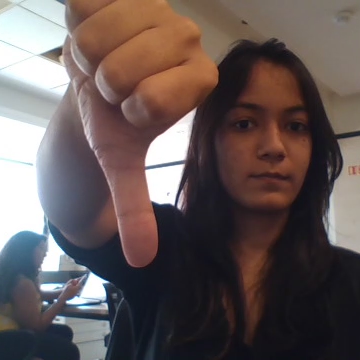
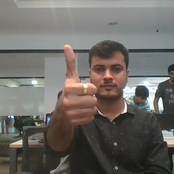
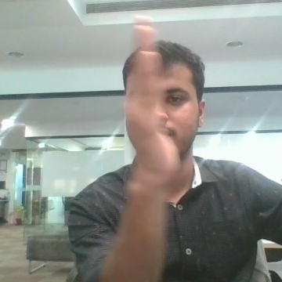
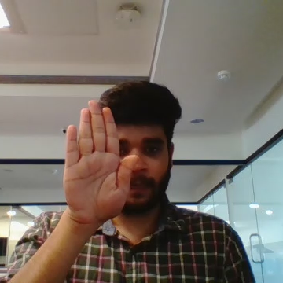

  
  
  
  

With Home electronic industry making a major shift and moving towards building and manufacturing smart devices, such as a Smart TV/ Laptop, the role of Deep learning based applications can find immense possibilities. One such area could be Gesture Recognition.
Think about yourself sitting in your bedroom watching a movie on tv, and you just witnessed the best scene of the movie, and you wanna rewind the scene. Thanks to deep learning and Gesture Recognition like applications, you may now just gesture to your tv, and it will do it for you :) Not only this Gesture recognition would truly retransform the way we interact to our home devices on a daily basis. 

Say you want to develop a cool feature in the smart-TV that can recognize five different gestures performed by the user which will help users control the TV without using a remote. This project does exactly that. I make 5 Gesture Movements - Thumbs up/down, swipe left/right, stop, and train deep neural network models to learn to identify the gestures.
The gestures are continuously monitored by the webcam mounted on the TV. Each gesture corresponds to a specific command:
Thumbs up:  Increase the volume
Thumbs down: Decrease the volume
Left swipe: 'Jump' backwards 10 seconds
Right swipe: 'Jump' forward 10 seconds  
Stop: Pause the movie

Dataset:
The data consists of a few hundred videos categorized into one of the five classes. Each video (typically 2-3 seconds long) is divided into a sequence of 30 frames(images). These videos have been recorded by various people performing one of the five gestures in front of a webcam - similar to what the smart TV will use. Each video is a sequence of 30 frames (or images). The frames are uploaded on the google drive link : https://drive.google.com/uc?id=1ehyrYBQ5rbQQe6yL4XbLWe3FMvuVUGiL

Approach:
I have defined a generator function that is able to successfully input a batch of videos to the model.
In the generator, the images are preprocessed, as we have images of 2 different dimensions as well as batch of video frames is created. I have experimented with `img_idx`, `y`,`z`, image resizing, normalization, batch size in order to obtain a high accuracy.
I experimented with different values of Batch size, and found the maximum working value to be 80. Increasing batch size further, resulted in a ResourceExhaustedError. So we have chosen batch size of 80 as our final value.
I have tried multiple models based on 3D Convolution, CNN + LSTM and Transfer Learning models.

The highest validation accuracy reached with Transfer Learning models, having Validation acc as 93% and Training Accuracy as 93% as well.

|     Experiment Number    	|     Model     	|     # Trainable   Parameters    	|     Validation   Accuracy    	|     Training   Accuracy    	|     Model Details                                                                                                                                                                                 	|     Explanation                                                                                                                                                                                                                                                                	|
|--------------------------	|---------------	|---------------------------------	|------------------------------	|----------------------------	|---------------------------------------------------------------------------------------------------------------------------------------------------------------------------------------------------	|--------------------------------------------------------------------------------------------------------------------------------------------------------------------------------------------------------------------------------------------------------------------------------	|
| 1. model_3d_1            	| Conv3D        	| 1,968,613                       	| 78%                          	| 97%                        	| - Conv3D Layers = 4 - Filter Size = (5,5,3), (3,3,3)  - MaxPooling3D Layers = 4 - Dense Layers = 3    - dropout (last 2 layers) = 0.25 - Batch Size = 80 - Frames to be sampled = 20              	| Model is overfitting a lot, final accuracy stands at 100% after the 15th epoch.     Next: we will work on reducing the overfitting of the model by decreasing the filter size and increasing the dropout rate                                                                  	|
| 2. model_3d_2            	| Conv3D        	| 1,761,109                       	| 75%                          	| 85%                        	| - Conv3D Layers = 4    - Filter Size = (3,3,3) - MaxPooling3D Layers = 4 - Dense Layers = 3 - dropout (last 2 layers) = 0.5 - Batch Size =  80 - Frames to be sampled = 20                        	| Model is   overfitting but the final accuracy has not moved to 100% like the first model   it stands at 94%.     Next: we will   reduce the batach size and see if it impacts the overfitting with the same   model structure                                                  	|
| 3. model_3d_3            	| Conv3D        	| 1,761,109                       	| 80%                          	| 87%                        	| - Conv3D Layers = 4    - Filter Size = (3,3,3) - MaxPooling3D Layers = 4 - Dense Layers = 3 - dropout (last 2 layers) = 0.5 - Batch Size = 40 - Frames to be sampled = 20                         	| Good results   obtained, overfitting is present but at a much smaller scale     Next: we will   add a small dropout layer post the last conv layer to see if we get better   results                                                                                           	|
| 4. model_3d_4            	| Conv3D        	| 1,761,109                       	| 77%                          	| 81%                        	| - Conv3D Layers = 4   - Filter Size = (3,3,3) - MaxPooling3D Layers = 4 - Dense Layers = 3 - dropout (last 3 layers) = 0.5, 0.2 - Batch Size = 40 - Frames to be sampled = 16                     	| Overfitting reduced but so did the validation accuracy  Next: we will remove the dense layers and replace them with a GlobalAveragePooling3D layer, this will reduce the parameter count by half                                                                               	|
| 5. model_3d_5            	| Conv3D        	| 87,765                          	| 75%                          	| 88%                        	| - Conv3D Layers = 4   - Filter Size = (3,3,3) - MaxPooling3D   Layers = 4 - GlobalAveragePooling3D = 1  - dropout (last   3 layers) = 0.5, 0.2 - Batch Size = 80 - Frames to be   sampled = 20    	| There is overfitting but the results are good compared to the number of parameters of the model    Next: we will re-run model4 with higher batch size and for more epochs and see if we can have any better results                                                            	|
| 6. model_3d_6            	| Conv3D        	| 1,761,109                       	| 81%                          	| 93%                        	| - Conv3D Layers = 4    - Filter Size = (3,3,3) - MaxPooling3D Layers = 4 - Dense Layers = 3 - dropout (last 3 layers) = 0.5, 0.2 - Batch Size = 80 - Frames to be sampled = 16                    	| Model is still overfitting.    Next: We’ll try few models with CNN + LSTM                                                                                                                                                                                                      	|
| 7. model_ cnn_lstm_1     	| CNN + LSTM    	| 1,004,549                       	| 71%                          	| 82%                        	| -Time Distributed Layers = 6    -Filter Size = (3,3) -Lstm Cells = 64 -Dense Neurons = 64 -dropout (last 2 layers) = 0.25 -Batch Size = 80                                                        	| Model starts overfitting beyond 15th epoch, with no more significant improvement in Validation accuracy.     Next: We’ll try to reduce LstmCells in order to reduce number of parameters.                                                                                      	|
| 8. model_ cnn_lstm_2     	| CNN + LSTM    	|             695,173             	| 72%                          	| 90%                        	| -Time Distributed   Layers = 6    -Filter Size = (3,3) -Lstm Cells = 32 -Dense Neurons = 64 -dropout (last 2 layers) = 0.25 -Batch Size = 80                                                      	| No. of Parameters significantly reduced. The model overfitting starts during later epochs, but no improvement in Validation Accuracy observed,     Next: We’ll double the LstmCells and Neurons, while also increasing dropout to ensure check on overfitting.                 	|
| 9. model_ cnn_lstm_3     	| CNN + LSTM    	|            1,656,452            	| 80%                          	| 89%                        	| -Time Distributed Layers = 6    -Filter Size = (3,3) -Lstm Cells = 128 -Dense Neurons = 128 -dropout (last 2 layers) = 0.5 -Batch Size = 80                                                       	| No. of parameters increased. Even though the overfitting issue exists it is not as bad as in previous models.       Next: Lets experiment with half of the dense neurons in LstmCells, while slightly reducing dropout to ensure no significant drop in training accuracy.     	|
| 10. model_ cnn_lstm_4    	| CNN + LSTM    	|            1,647,877            	| 75%                          	| 85%                        	| -Time Distributed Layers = 6    -Filter Size =  (3,3) -Lstm Cells = 128 -Dense Neurons = 64 -dropout (last 2 layers) = 0.35 -Batch Size = 80                                                      	| The model is   slightly overfitting with ~ 11% difference between training and validation accuracy. No. of parameters is still large.  Next: Let us   add another hidden layer in our network, while reducing other parameters, and see the results.                           	|
| 11. model_ cnn_lstm_5    	| CNN + LSTM    	|            1,071,621            	| 80%                          	| 99%                        	| -Time Distributed Layers = 7 -Filter Size = (3,3) -Lstm Cells = 64 -Dense Neurons = 64 -dropout (last 2 layers) = 0.25 -Batch Size = 80                                                           	| The validation accuracy did improve from the previous model, but the model is extremely overfitting. The number of parameters has decreased compared with previous   model.    Next: We’ll remove the extra added layer, and reduce the neurons, and also reduce dropouts.     	|
| 12. model_ cnn_lstm_6    	| CNN + LSTM    	|            1,002,309            	| 75%                          	| 94%                        	| -Time Distributed Layers = 6 -Filter Size = (3,3) -Lstm Cells =  64 -Dense Neurons = 32 -dropout (last 2 layers) = 0.1 -Batch Size = 80                                                           	| The model   overfitting issue still exits.      Next: We’ll   reduce another hidden layer, reduce the batch size, and see the results.                                                                                                                                         	|
| 13. model_ cnn_lstm_7    	| CNN + LSTM    	|            1,724,677            	| 72%                          	| 92%                        	| -Time Distributed   Layers = 5    -Filter Size = (3,3) -Lstm Cells = 64 -Dense Neurons = 64 -dropouts (last 2 layers) = 0.25 -Batch Size = 80                                                     	| Model still   overfits. Number of parameters has further increased.  Next: Lets   bring back the hidden layer removed in previous moel, introduce more dropouts   in the other hidden layers. Also lets add more LstmCells, and check results   for more number of epochs.     	|
| 14. model_ cnn_lstm_8    	| CNN + LSTM    	|            1,438,613            	| 75%                          	| 79%                        	| -Time Distributed Layers = 6    -Filter Size = (3,3) -Lstm Cells =  128 -Dense Neurons = 128 -dropouts (0.3, 0.3, 0.5) -Batch Size = 80                                                           	| Although the training accuracy has suffered a bit, the model has descent performance and so far the best. The number of trainable parameters too has decreased.  Next: Let us try to experiment with the filter size – lets reduce the filter size from current 3,3 to 2,2.    	|
| 15. model_ cnn_lstm_9    	| CNN + LSTM    	|            1,430,037            	| 80%                          	| 96%                        	| -Time Distributed Layers = 6    -Filter Size = (2,2)    -Lstm Cells = 128    -Dense Neurons = 64    -dropouts   (0.25, 0.4)    -Batch Size =   80                                                 	| With reduced   filter size, the model still overfits.  Next: We’ll   build models using Transfer Learning, and see if any improvement is obtained.                                                                                                                             	|
| 16. model_mobilenet      	| MobilNet      	| 3,816,517                       	| 95%                          	| 95%                        	| - Batch Size = 10 - Frames to be sampled   = 16                                                                                                                                                   	| Trained the full model.    Excellent results, this truly shows the power of transfer learning.     Next: Lets experiment with MobilNetV2                                                                                                                                       	|
| 17. model_mobilenetv2    	| MobilNetV2    	| 4,931,077                       	| 83%                          	| 93%                        	| - Batch Size = 10 - Frames to be sampled = 16                                                                                                                                                     	| There is somewhat overfitting but with some more experiments we can get even better results.                                                                                                                                                                                   	|

Source: <a href="https://github.com/akhilsn/DLNeuralNetwork/tree/master/GestureRecognition"><i class="large github icon"></i>akhilsn/Gesture Recognition</a>
