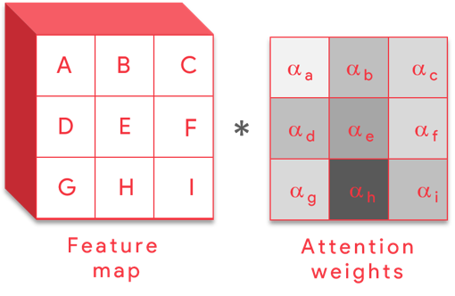
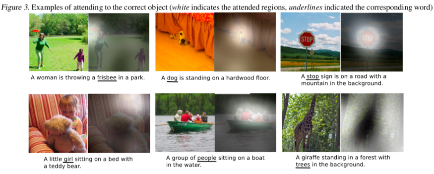
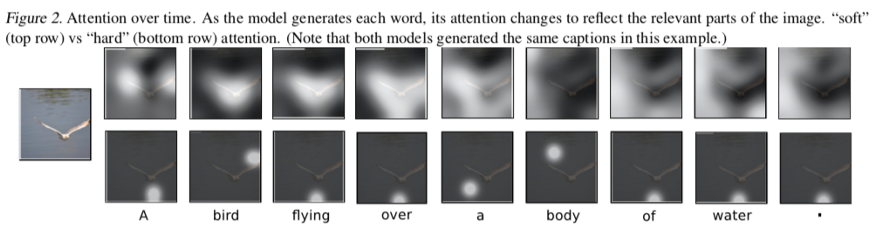

### Problem Statement:
To create a deep learning model which can explain the content of an image in the form of speech through Caption generation with attention mechanism on Flickr8K dataset. This kind of model is a use-case for blind people so that they can understand any image with the help of speech. The caption generated through a encoder-decoder (CNN-RNN) based model will be converted to speech using a text-speech library.

### Approach:

The encoder parts involve the convolution of the input image with the help of various convolution, max pooling, and fully connected layers. Since here we are not dealing with the classification of the image, therefore softmax layer is not needed at the end. The final output of the encoder part will be th.e generation of the feature vector.
  
The project involves two steps:
- Image to caption generation which is based on the popular Show, Attend and Tell paper.
- Conversion of the captions generated into an audio output with the help of text to speech library.
  
Will add visual block diagrams soon...
  
Working of the encoder - decoder part of the model, 
 Steps:
- The encoder (CNN) generates the feature vector h0.
- h0 is then fed to RNN as an input along with the word vector X1.
- For RNN, there are 2 inputs, and it generates h1 based on these 2: h1=f(X1,h0)
- h1 through a trainable matrix is trained and fed to score, which will predict the next word based on max probability.
- The next word predicted will be passed onto the next timestamp along with h1.

### Challenges:
One of the majr limitations of the traditional method is with the input of the image-: Here, using traditional methods, the image is passed as the input to every RNN layer at every timestamp which can pass 'unnecessary' information into the model and can decrease the computational speed of the entire model. Because of this limitation, the model suffers in predicting the word sequence correctly.

Let me list down some drawbacks that I can think of now, 
1. decoder is trying to predict the next word with just one look at the image.
2. we feed the decoder only once or we feed the same feature vector at eveyr time stamp.
3. due to irrelevant information/noise (presnet in the entire image) predictions would get affected.
4. the kind of spatial information needed is not produced by the encoder.
5. what if at each time stamp the feature vector changes according to the previous context.

### Possible solution - Attention Models:
Earlier, we assumed that the spatial dimensions of the CNN image features were averaged together. Now, we describe a method to weight these spatial locations according to their perceived importance - the technique is referred to as an attention mechanism.
 
With the help of attention mechanism, instead of passing the complete input image to the RNN at every timestamp, we can pass different relevant parts of the image to it. This can solve the limitation we had with the traditional models.
  

Will organize detailed explaination and add code soon..

 

    
    
  

 
