### Problem Statement:
To classify emotions out of musical pieces with the help of deep neural network models using time, frequency and time-frequency based audio inputs.

### Approach:
In this project the MER problem has been looked at in the context of time and frequency acoustic features. A number of features are implemented across   
(i) time domain,  
(ii) frequency domain and  
(iii) time-frequency domain,
  rather than limiting to just waveform or a spectrogram visual feature, as has been the study in the past.
 
This means that features from time domain that are characterized by loudness, pitch etc. such as Amplitude Envelope, zero crossing rate, root-mean square energy are studied as time series. Features from frequency domain such as spectral features or temporal features are studied as numerical or time series format again. The time-frequency domain features in visual representation such as Spectrogram, chromagrams, CQT transform, MFCCs are taken as image inputs to pre-trained models.
  - Multiple model experiments are demonstrated along with relevant reasoning.
  - The performance for all the three approaches is demonstrated and compared.
 
Part of the objective of the present study is also to demonstrate how eliminating any sort of manual effort required on extracting features (using deep learning with image data approach) compares with the approach that constitute manual effort to a certain extent in designing the time or frequency time-series features.
 
Overall the main objective of this study is to explore new avenues with potential performance improvements in Neural network-based emotion classification models with time-frequency features such as spectrograms, chromagrams etc., time series features extracted from the waveforms as inputs, experimented on different neural network architectures.

  
### Data Distribution:

 

  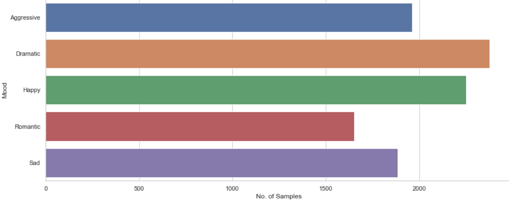 

 

- Time-domain Feature Extraction Pipeline
  - Below are some of the common time domain features:
    1.	Amplitude Envelope (AE)
    2.	Root-Mean-Square Energy (RMSE)
    3.	Zero-Crossing Rate (ZCR)

- Combined Time and Frequency Domain Feature Extraction Pipeline
  - Below are some of the frequency domain features:
    1. Time domain features (e.g., Amplitude Envelope, RMSE, Zero-Crossing Rate)
    2. Spectral Features (e.g., Spectral Flux, Spectral roll-off etc.)
    3. Temporal Features (e.g., MFCCs)

 

  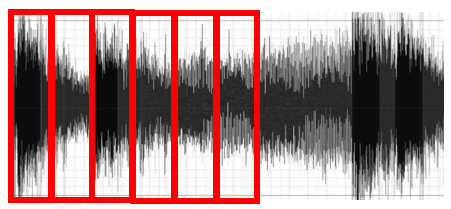 

 

- Time-Frequency Feature Extraction Pipeline
  - Below are the some of the time-frequency domain features:
    1. Spectrograms/ Mel-Spectrograms
    2. Chromagrams
    3. CQT Transforms
    4. Tempograms

 

  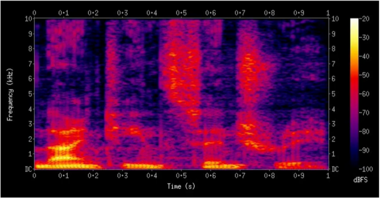 

  

### Model Implementation:
1. Time Domain Feature Model Implementation: 
  - the model combination of 1D CNN and BiLSTM has the best performance, with a moderately good accuracy of 70% and low MSE on test data.
2. Combined Time and Frequency Domain Feature Model Implementation: 
  - a densely deep ANN has the best performance with high accuracy of 84% an low MSE on test data.
3. Time-Frequency Feature Model Implementation: 
  - the transfer learning based model (VGG19Net) with 7 fully connected layers on top has the best performance with high accuracy of 80% and an AUC of 97% on test data.

 

  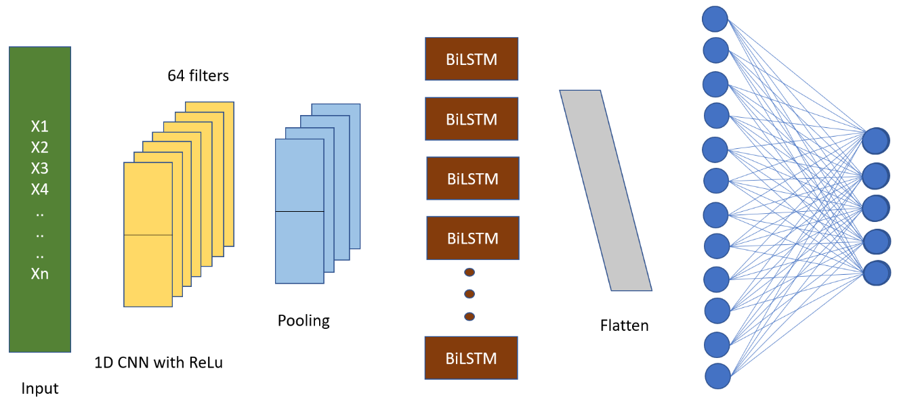 

  

   

  

### Results:
#### Amplitude Envelope (approach1)
 

  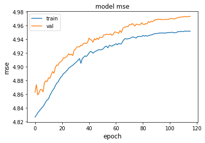

 

  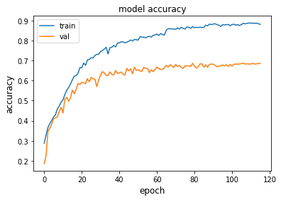

 

#### Combined Time and Frequency approach
 

  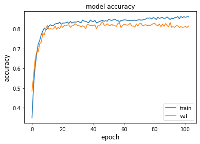

 

#### Time-Frequency approach
- Linear Spectrogram
 

  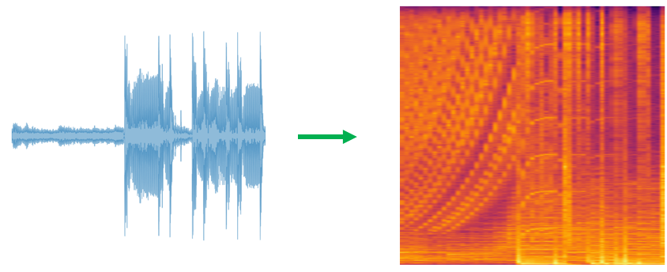

 

  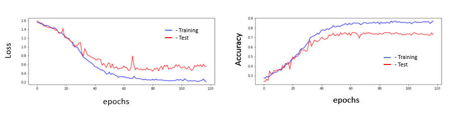

 

  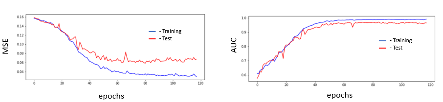

 
- CQT
 

  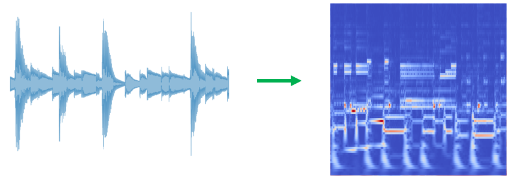

 

  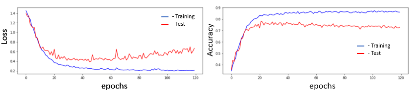

 

  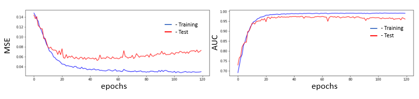

 
- Log-CQT
 

  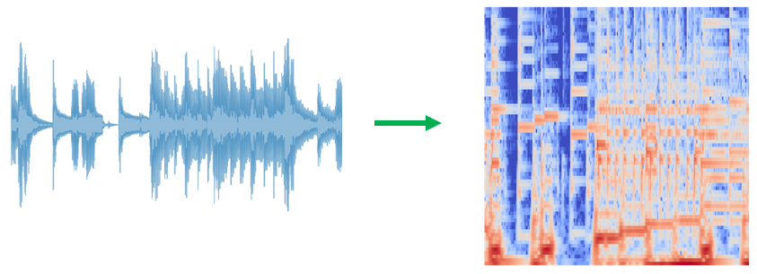

 

  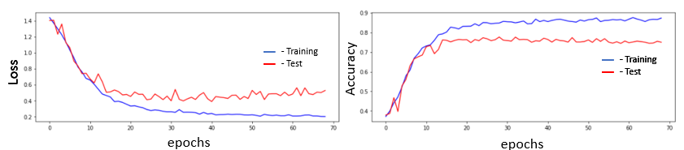

 

  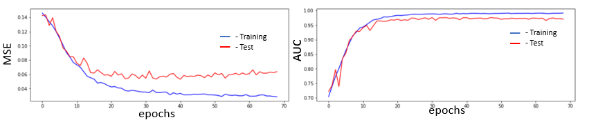

 
- Chroma
 

  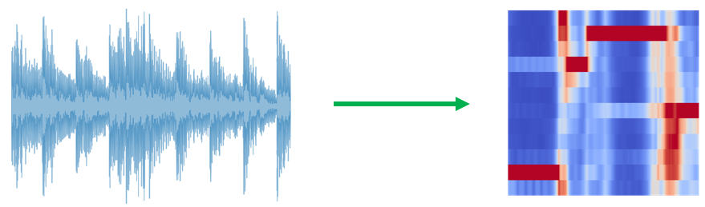

 

  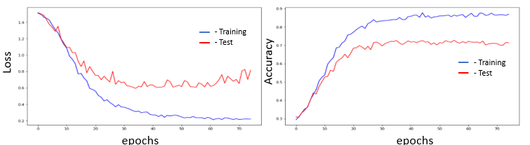

 

  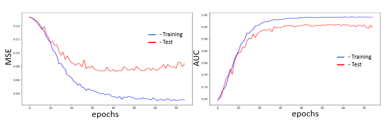

 
- MFCCs
 

  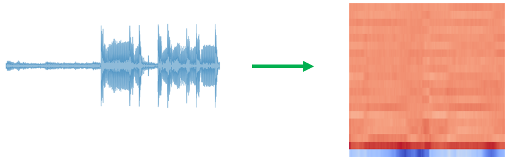

 

  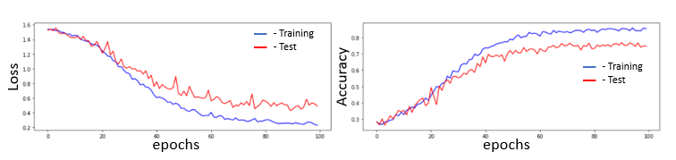

 

  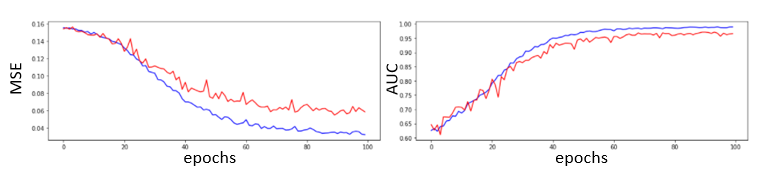

 
