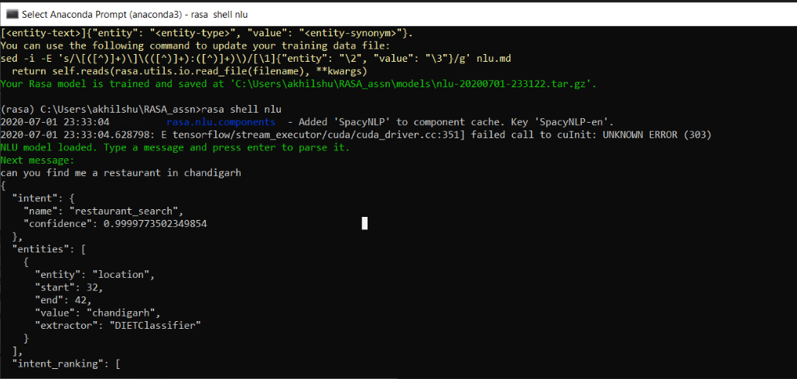
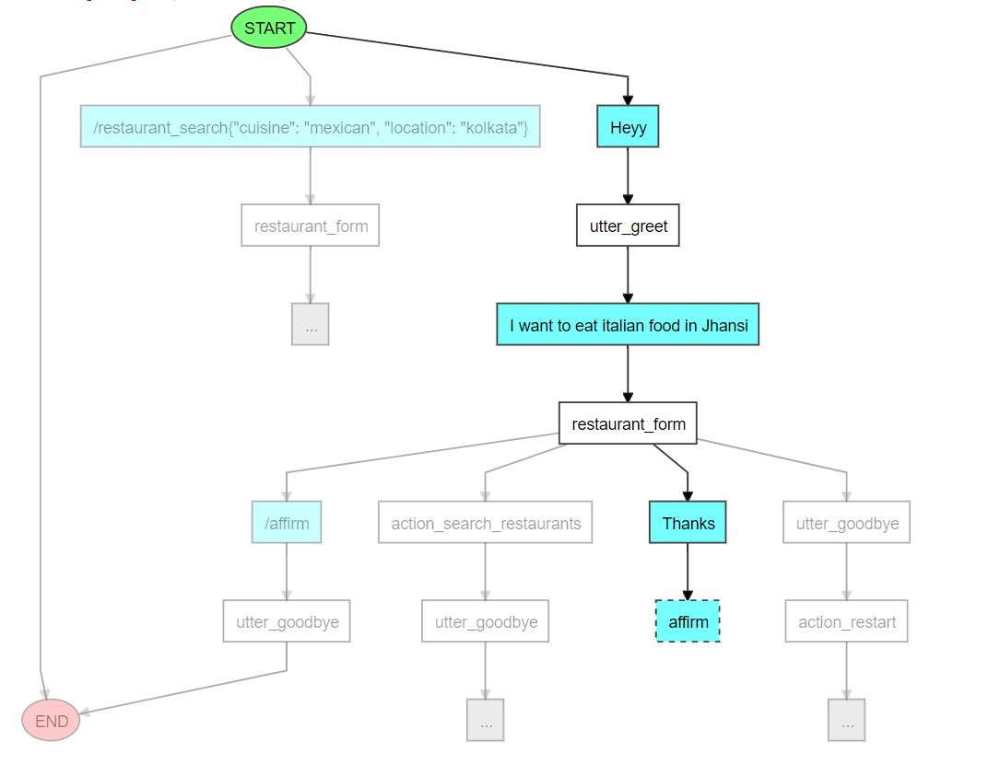

In this project, I have built a domain-specific chatbot, specifically, a restaurant search chatbot. The bot is able to 'talk' to users in English, and is able to help them search for restaurants offering multiple cuisines, suiting different budgets, etc., in several cities. For building this conversational chatbot, I have used an open-source machine learning (ML) framework called RASA.
 
Conversation, or dialogue, is a fundamental aspect of human language, and arguably the most interesting challenge in building truly intelligent NLP systems. Any conversational system has primarily two components:
- Natural Language Understanding, or NLU
- Dialogue Management System
which carries out the overall conversation
 
The first layer of a conversational system, NLU, interprets the free text provided by the user. It basically takes an unstructured text phrase or sentence, understands what the user probably intends to say, extracts entities from the text phrase or sentence, and converts it into structured data.
 

 
Training: A higher number of and variance in training examples improves the performance of the NLU layer (i.e., intent and entity recognition).
Each training example further can be understood as having three components, namely, text, intent and entities: 
 
Text is the search query: It is an example of what would be submitted for parsing. 
Intent is the intent that should be associated with the text. 
Entities are specific parts of the text that need to be identified.  
 
Pipelines of NLU model: For customising the model and how to act on the data set, I have to choosen supervised_embeddings pipeline which feeds specifically on the data set and doesn’t use any pre-trained word vectors.
 
The second aspect of the conversational framework is the Dialogue Management Model. A dialogue management model predicts the response or action that the chatbot should take based on the stage of the conversation. These actions/responses could be to print results on the screen, fetch data from a database, send a mail to the user or simply say "Thank you!".
 
The dialogue management model accomplishes the task of learning to take the correct action based on the stage of the conversation. The responsible Rasa layer for Dialogue Management is the Rasa Core. 'Stories' are the training data for Rasa Core’s dialogue management system. Rasa Core uses a variant of Recurrent Neural Networks (RNNs), which are 'sequence models', called LSTMs (Long Short-Term Memory), to learn dialogue flow.
 

 
In the implementation of this chatbot, I use three memory slots, for Location, Cuisine, and Budget. And for querying a ready to use Restaurant database, I have used the Zomato API. After adding basic stories for the bot to learn from, I have used RASA Interactive to train for further stories. The RASA Interactive learning is a great tool by Rasa that allows you to provide feedback on errors, thereby correcting and guiding the bot whenever it goes wrong.
 
Since there are multiple levels of functionalities, and multiple ways in which a bot can be built, I would like to put down few pointers below, based on which my chatbot has been built,

The bot takes the following inputs from the customer:
- **City**: Take the input from the customer as a text field. For example:
    - Bot: In which city are you looking for restaurants?
    - User: anywhere in Delhi
- **Cuisine Preference**: Take the cuisine preference from the customer. The bot should list out the following six cuisine categories (Chinese, Mexican, Italian, American, South Indian & North Indian) and the customer can select any one out of that. Following is an example for the same:
    - Bot: What kind of cuisine would you prefer?
    
            Chinese
            Mexican
            Italian
            American
            South Indian
            North Indian
    - User: I’ll prefer Italian!
- **Average budget for two people**: Segment the price range (average budget for two people) into three price categories: lesser than 300, 300 to 700 and more than 700. The bot should ask the user to select one of the three price categories. For example:
    - Bot: What price range are you looking at?

            Lesser than Rs. 300
            Rs. 300 to 700
            More than 700
    - User: in range of 300 to 700
    
- **Email:** The bot should ask the user whether he/she wants the details of the top 10 restaurants on email. If the user replies 'yes', the bot should ask for user’s email id and then send it over email. Else, just reply with a 'goodbye' message. The mail should have the following details for each restaurant:

            Restaurant Name
            Restaurant locality address
            Average budget for two people
            Zomato user rating
 
***Important Notes***
- The bot would only work for Tier-1 and Tier-2 cities in India (I have extracted Tier1 and Tier2 cities in India from wikipedia), since for smaller cities, there is not enough restaurant database with us.
- The bot should provide results for tier-1 and tier-2 cities only, while for tier-3 cities, it should reply back with something like "We do not operate in that area yet".
- The bot would be able to identify common synonyms of city names, such as Bangalore/Bengaluru, Mumbai/Bombay etc.
- While showing the results to the user, the bot would display the top 5 restaurants in a sorted order (descending) of the average Zomato user rating (on a scale of 1-5, 5 being the highest). The format would be: {restaurant_name} in {restaurant_address} has been rated {rating}.
 
The complete code for the Rasa Chatbot can be found at my github page, <a href="https://github.com/akhilsn/RASA-chatbot"><i class="large github icon"></i>akhilsn/chatbot</a>
