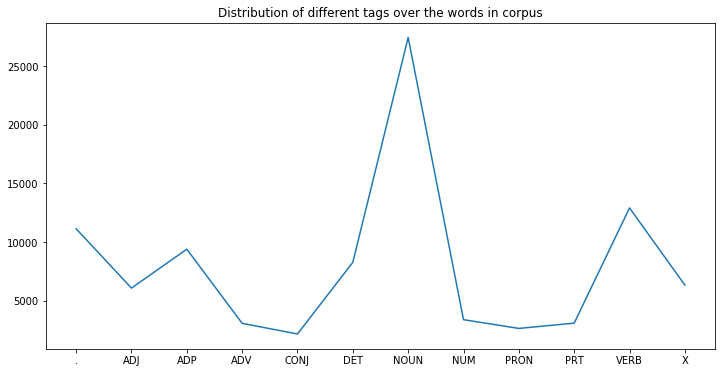

### Problem:
The **Vanilla Viterbi** turns out to be slightly inefficient while trying to determine the POS tags for the unknown words in a dataset. This is because, for unknown words, the emission probabilities for all candidate tags are 0, so the algorithm arbitrarily chooses (the first) tag. In this project I have proposed three approaches by modifying the Viterbi algorithm in order to get better accuracies in terms of determining correct POS tags for unknown words in the test data. 
The **best approach** is able to obtain **~95.4% accuracy**, which is significantly better than the **Vanilla Viterbi** having **~90.6%** accuracy. 
 
For this project, I have used the Treebank dataset of NLTK with the 'universal' tagset. The Universal tagset of NLTK comprises only 12 coarse tag classes as follows: Verb, Noun, Pronouns, Adjectives, Adverbs, Adpositions, Conjunctions, Determiners, Cardinal Numbers, Particles, Other/ Foreign words, Punctuations.
 

### Introduction to Viterbi:
The basic idea of the Viterbi algorithm is as follows - given a list of observations (words) O1,O2,....On, to be tagged, rather than computing the probabilities of all possible tag sequences, you assign tags sequentially, i.e. assign the most likely tag to each word using the previous tag.
 
More formally, the tag Tj is assigned to each word Oi such that it maximises the likelihood:
 
P(Tj|Oi)=P(Oi|Tj)∗P(Tj|Tj−1), where
  Tj−1 is the tag assigned to the previous word. 
  Tj is assumed to be dependent only on the previous tag Tj−1, and hence the term P(Tj|Tj−1).
  
In other words, you assign tags sequentially such that the tag assigned to every word Oi maximises the likelihood P(Tj|Oi) locally, i.e. it is assumed to be dependent only on the current word and the previous tag. This algorithm does not guarantee that the resulting tag sequence will be the most likely sequence, but by making these simplifying assumptions, it reduces the computational time manifold.
 
This is also why it is called a **greedy algorithm** - it assigns the tag that is most likely at every word, rather than looking for the overall most likely sequence. 
 

### Problem Solving:
I have used three approches here to solve the arbitrary PoS tagging done by the Vanilla Viterbi algorithm on unknown words:

- ***Approach1: Find out the most frequent tag in the corpus, and substitute the Unknown words with 'NOUN' tags.***
 
Below figure shows the different tag distribution over the words in corpus,
 

  

  

- ***Approach2: Adjust emission probability with a small non-zero value instead of zero, and assign POS tag based on the max. of product of the adjusted emission prob. and transition prob.***
 
- ***Approach3: Use rule based technique to assign tags based on some rules such as tagging words ending with 'ing', 'ed', containing numbers etc.***
 
### Observations:

Accuracies achieved by different Viterbi algorithm versions,
  
- **Vanilla Viterbi: 90.6%**
- **Approach1: 93.7%**
- **Approach2: 93.8%**
- **Approach3: 95.4%**

Since running on entire test dataset would take more than 6-7hrs, I have tested on a few sample sentences of the test dataset. If tested on the complete dataset, the accuracy is expected to be slightly higher.

### Inference:

All three approaches have provided 3% - 6% of improvement in the accuracies over the Vanilla model.
 
Approach3 is based on a rule-based technique and has been the best so far providing almost 6% improvement over the vanilla model.
 
