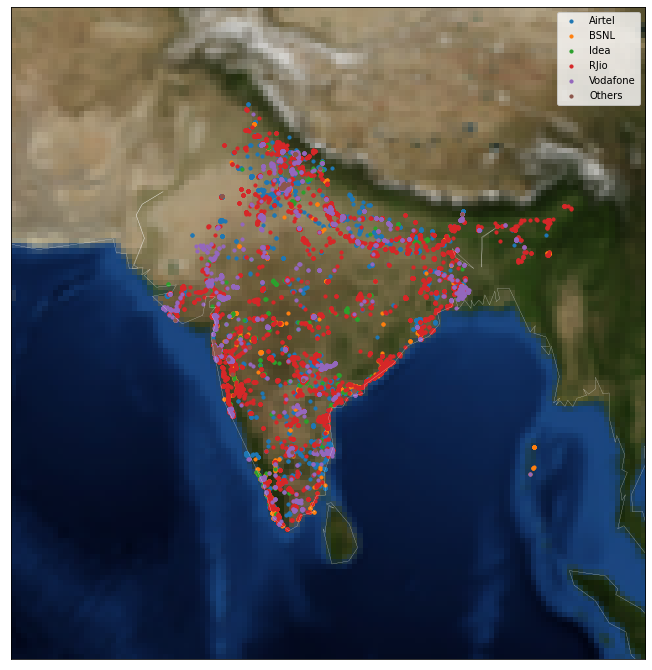
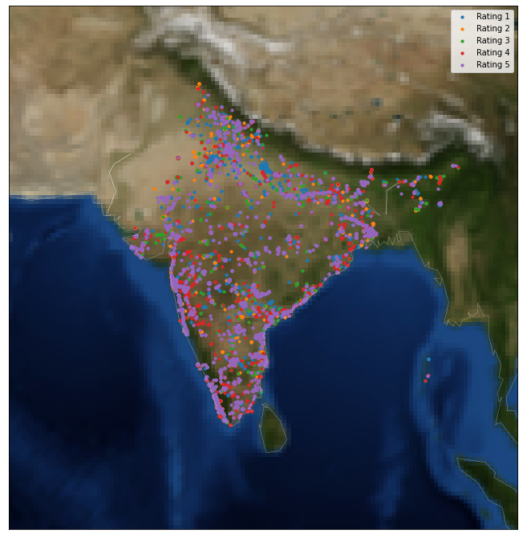

The dataset provides Customers Feedback Captured using TRAI MyCAll App. Customers rates their experience about telecom voice call quality in real time and help TRAI gather customer experience data along with Network data. The dataset includes feedback for the months September - November 2019

It is a good Dataset to do some EDA, especially if you wanna begin experimenting with Basemap.

Dataset along with the code can be found at Source: <a href="https://github.com/akhilsn/Kaggle-Projects/tree/master/Voice%20Call%20Quality%20Experience%20EDA"><i class="large github icon "></i>akhilsn/IndiaVoiceQuality</a>
  

We try to find which network service, mobile generation does India's mobile subscriber use the most. We also note distribution of network across these months. 
Questions like possibility of user churn out of one operator during the three months of data is possible, mobile subscriber base statewise in india, Operator ratings to determine most popular or most successful operator among people etc,
Also to investigate finding with Basemap visualization. 

 
Notice how RJIO dominates the subscribers across India, but a little scarce in the middle (MP, Rajasthan).
  
 
Notice the purple points in majority, indicating Rating5 reported by most of the mobile subscribers.
This shows that the Voice Quality via services across different Networks offered by different Operators is very good.
