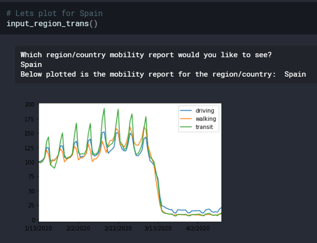
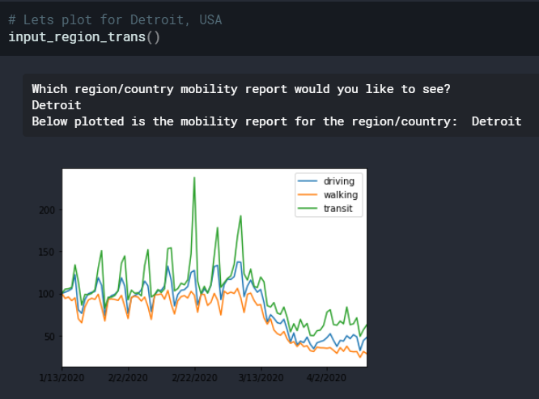

### Problem Statement:
COVID 19 cases began surfacing around January, and increasing every day. This dataset can be used to study impacts on mobility in this COVID 19 period.
Due to COVID 19 spreading all across the world, there have been strict measures taken by the Governments of various Countries. Due to this people's mobility has also reduced across regions. 
The given dataset is an Apple provided mobility report (across transportation types such as `walking`, `driving`, `transit`.)

>How the mobility of people carrying the Apple mobile phones has changed, provides us an opportunity to study the human mobility behaviors across the regions.
    
In this project, I have performed some Exploratory Data Analysis on this data to understand how the nations/regions followed some strict lockdown measures imposed by the governement, and how was the distribution of decreased mobility across different transport types. I have plotted the population mobility (population using Apple product) to understand whether lockdown restrictions were abided by people of those regions. 
If one is interested, the code can be run on any world region to visualize the mobility trends.

Source: <a href="https://github.com/akhilsn/Kaggle-Projects/tree/master/Apple%20Mobility%20Trends"><i class="large github icon"></i>akhilsn/Apple Mobility Trends across world</a>  

Lets look at mobility trends at Spain and Detroit USA.   

 

Spain is one among the top worst hit countries by COVID 19. As of 21st April there are 204,178 cases in Spain, and more than 20000 deaths.

>Note how the mobilty was pretty descent until a strict lockdown measures was taken by the 
Spanish Government. Note the dramatic drop around 12th March. This seems to be very much inline with the fact that Spanish Government imposed a nation wide
lockdown on 14th March.
  

 
Detroit is best known as the center of the U.S. automobile industry, and the "Big Three" auto manufacturers General Motors, Ford, and Fiat Chrysler are all headquartered in Metro Detroit. This industry requires many labors who come from far off places.

> Observe there is a major spike in transit mobility around 22nd Feb. Also throughout February, there was a strong transit mobility. I suppose this high transit mobility must have been due to people taking public transport to move back to their homes (as a panick action) due to sudden strong US government measures to fight COVID 19.

> Other than transit mobility, the mobility via driving or walking are not much and start dying down March onwards.
  

### Limitation: 
The dataset comes from Apple's product mobility, and hence the inferences would represent only fraction of the people who use Apple products. This becomes even more limiting in making inferences for regions, where Apple products do not have enough reach - this will result in very less data from that region.

### Further Work:
This dataset can be further used for making judgments in taking decisions or actions, as to which region is more vulnerable to become a hotspot (If the mobility of a city/ region is increasing suddenly, that would mean that the chances of COVID 19 spreading would increase, and government would require to take best measures to control this mobility).
