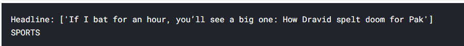
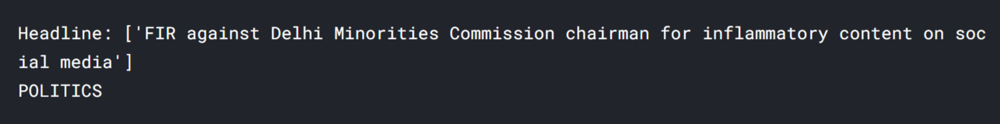

Here I have used the BBC headline news text, labeled in 5 categories, i.e., 'Tech', 'Sports', 'Business', 'Entertainment', and 'Politics', and then trained models with Logistic Regression and Naive Bayes.

This is a Kaggle problem, and the dataset for the same can be taken from my github or the kaggle website.
Source: <a href="https://www.kaggle.com/yufengdev/bbc-fulltext-and-category">kaggle-dataset</a>
 
Dataset contains Dataset contains labeled BBC articles with fulltext (Title, body) and category of over 2 thousand BBC full text articles.
 
The results obtained are very good for the dataset used. 
  For Logistic Regression model, the model test accuracy is 98.35% 
  For Naive Bayes model, the model test accuracy is a little higher at 98.65%  

Finally I try using some random out of the dataset headlines to test whether our model correctly classifies them into expected label class. And the results are extremely impressive. Below I paste some news headlines I used outside of the dataset. 

For the complete code please refer
Source: <a href="https://github.com/akhilsn/Kaggle-Projects/tree/master/BBC%20Text%20News%20Classification"><i class="large github icon "></i>akhilsn/BBC Text News Classification</a>
 
 

