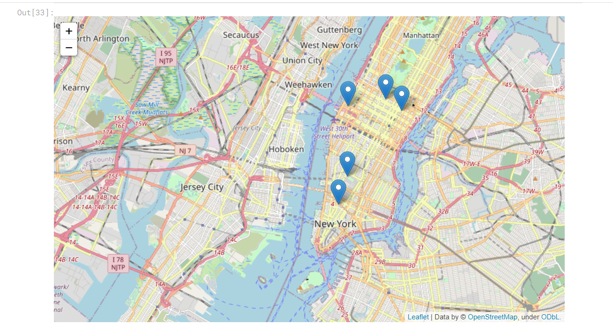
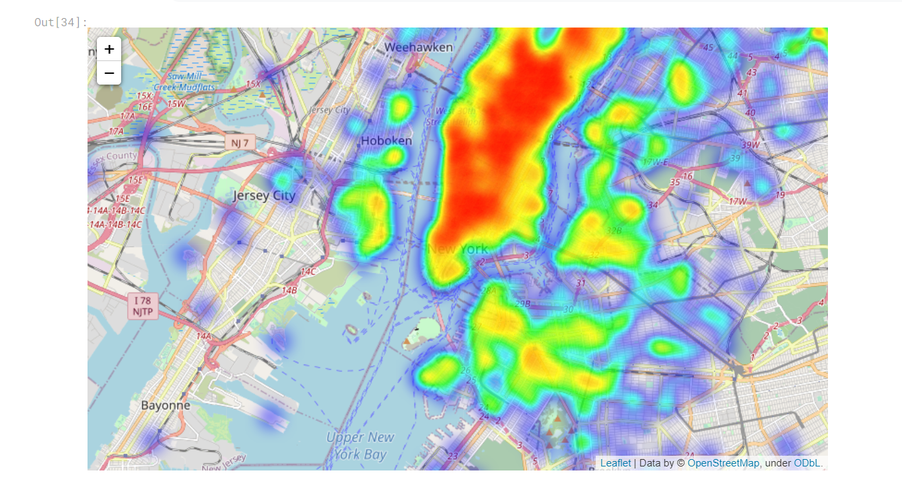
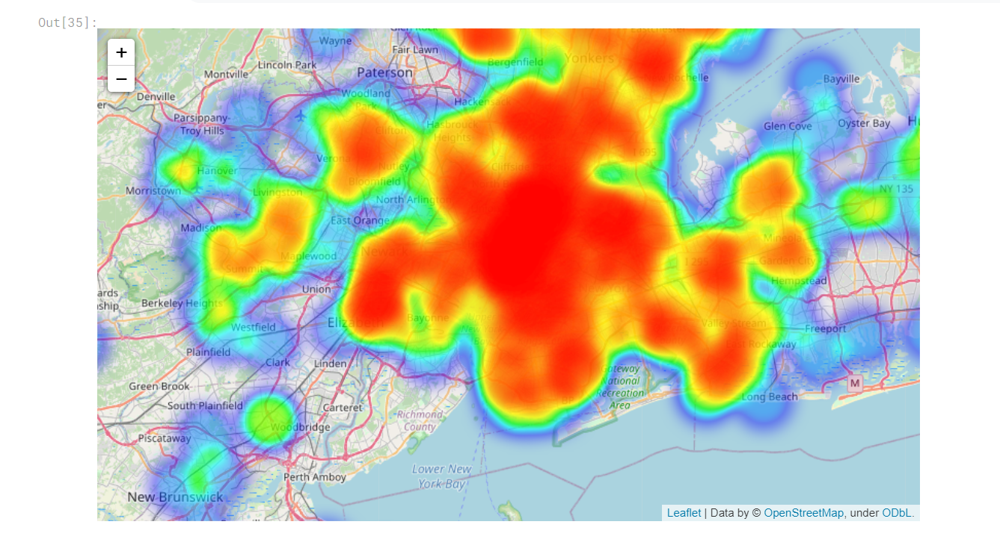
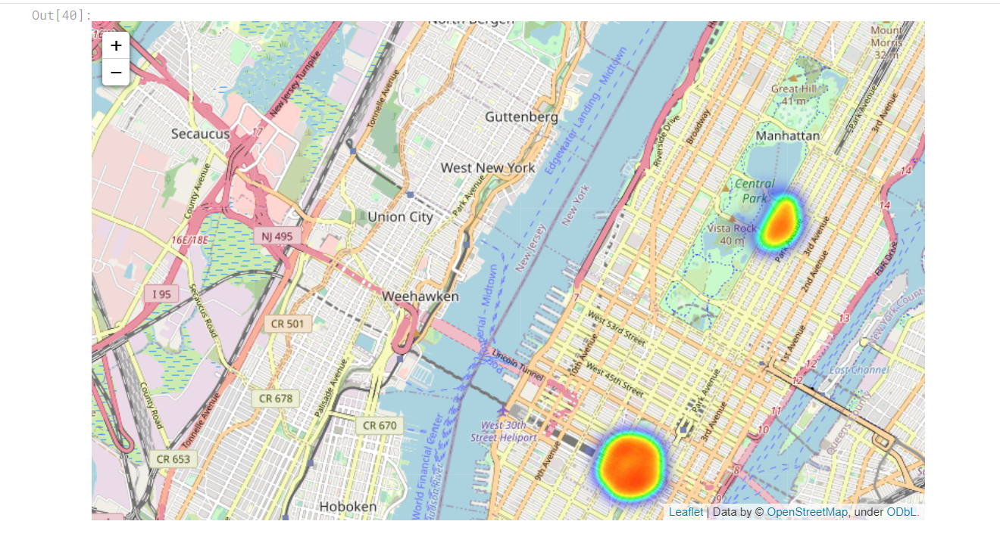
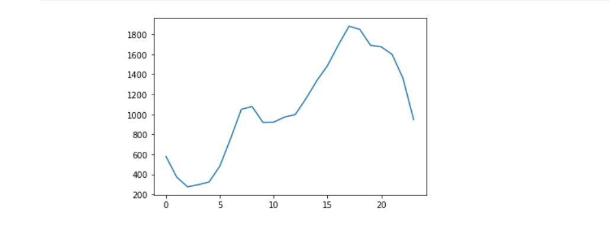
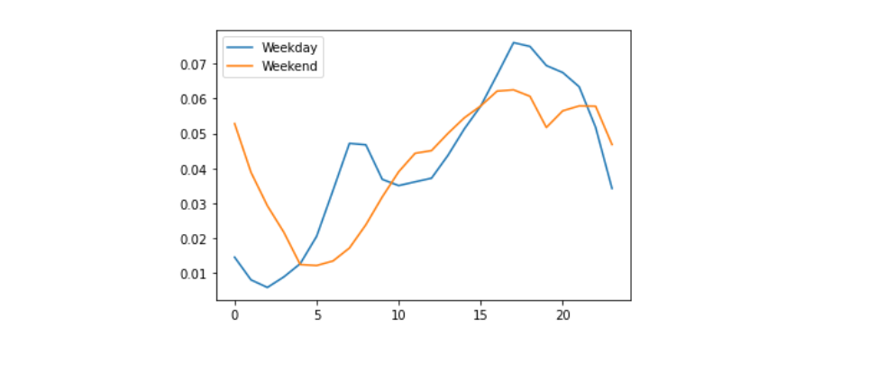
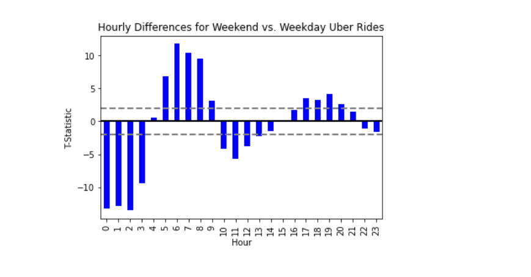

### Problem Statement:

The dataset used is from Uber Ride DropOffs around New York during July 2014. It is a huge dataset with ~0.8 million rides recorded.
I have tried to use the data to anlayze and visualize the different patterns of Uber Drop Offs in and around New York. 
I have specifically used geopy (used for calculating distance between two points) and Folium for the map visualizations.
 

   
   
   
   

 
With geopy and Folium, I have analyzed how within a certain radius, are uber rides distributed. With Heatmaps, it can be clearly seen which areas are the most busy, 
during which part of the day. This is called the seasonlity of traffic or rider demands.

Also, using heatmaps, I have tried to show how some areas around Park have less drop offs (semi circle heatmaps).
Finally, I have finished my assessment of whether or not we see hourly effects by using a t-test to see if each hour has a statistically different proportion of rides for weekends vs. weekdays.
 

   
   
   

 
The complete code to this project can be found here. <a href="https://github.com/akhilsn/Kaggle-Projects/tree/master/Uber%20City%20Rides%20New%20York"><i class="large github icon"></i>akhilsn/Uber Rides Drop Off Data Analysis</a>  
